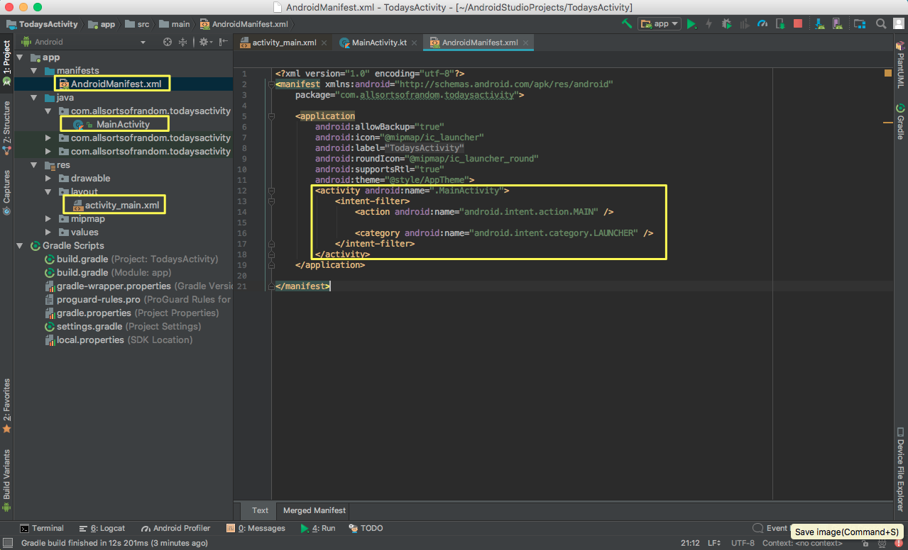
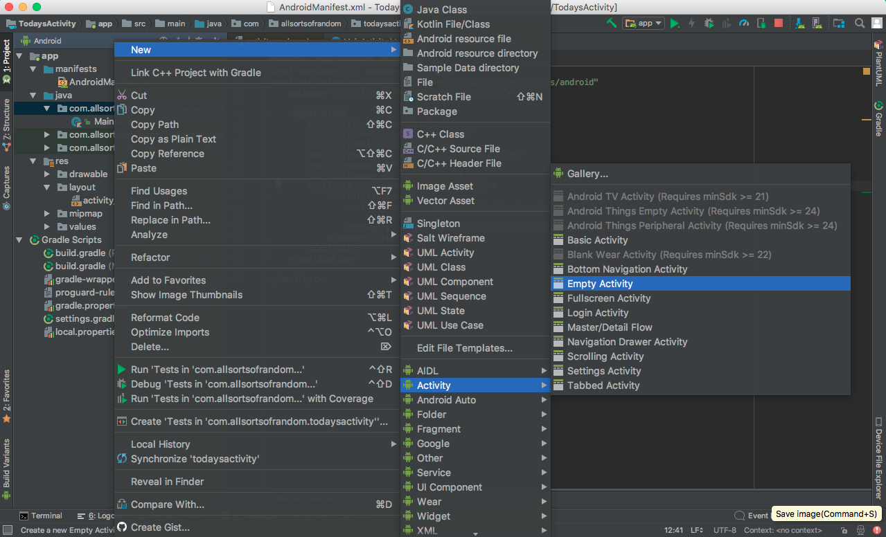
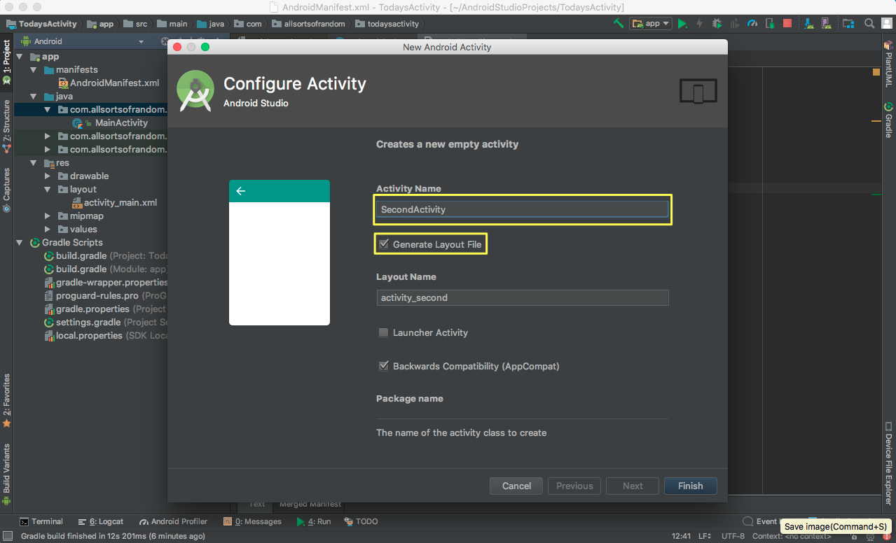

# Today's Activity: Start an Intent


### **Hello, Kotlin!**
1. Create Hello, World! App  


2. Project structure should look something like this:  


3. The files that are of main concern for us are:
    * AndroidManifest.xml
    * MainActivity
    * activity_main.xml

    ** which were all auto-generated when we created the project

4. Notice that intent category for MainActivity is `Launcher`. This effectively makes `MainActivity`, the main `entry point` of the app (i.e. if user clicks on the icon, it will launch this activity)

5. Create a new empty activity  


6. Configure Activity  


7. Notice that this generated SecondActivity and activity_second.xml. It has also defined the activity in the AndroidManifest.xml  


### **Start an Activity with an Intent**

1. Open `activity_main.xml` and add an id to the TextView. Example: `text_hello_world`

```xml
<?xml version="1.0" encoding="utf-8"?>
<android.support.constraint.ConstraintLayout xmlns:android="http://schemas.android.com/apk/res/android"
    xmlns:app="http://schemas.android.com/apk/res-auto"
    xmlns:tools="http://schemas.android.com/tools"
    android:layout_width="match_parent"
    android:layout_height="match_parent"
    tools:context="com.allsortsofrandom.todaysactivity.MainActivity">

    <TextView
        android:id="@+id/text_hello_world"
        android:layout_width="wrap_content"
        android:layout_height="wrap_content"
        android:text="Hello World!"
        app:layout_constraintBottom_toBottomOf="parent"
        app:layout_constraintLeft_toLeftOf="parent"
        app:layout_constraintRight_toRightOf="parent"
        app:layout_constraintTop_toTopOf="parent" />

</android.support.constraint.ConstraintLayout>
```
2. Open `activity_second.xml` and add a TextView. You can copy and paste the TextView from `activity_main.xml`

```xml
<?xml version="1.0" encoding="utf-8"?>
<android.support.constraint.ConstraintLayout xmlns:android="http://schemas.android.com/apk/res/android"
    xmlns:app="http://schemas.android.com/apk/res-auto"
    xmlns:tools="http://schemas.android.com/tools"
    android:layout_width="match_parent"
    android:layout_height="match_parent"
    tools:context="com.allsortsofrandom.todaysactivity.SecondActivity">

    <TextView
        android:id="@+id/text_hello_second_activity"
        android:layout_width="wrap_content"
        android:layout_height="wrap_content"
        android:text="Hello Second Activity!"
        app:layout_constraintBottom_toBottomOf="parent"
        app:layout_constraintLeft_toLeftOf="parent"
        app:layout_constraintRight_toRightOf="parent"
        app:layout_constraintTop_toTopOf="parent" />
</android.support.constraint.ConstraintLayout>
```
3. Assign an id to the TextView. Example: `text_hello_second_activity`
4. One way to trigger a redirect to a new activity/ screen is through a click event. Add an onClickListener in MainActivity

```kotlin
package com.allsortsofrandom.todaysactivity

import android.content.Intent
import android.support.v7.app.AppCompatActivity
import android.os.Bundle
import kotlinx.android.synthetic.main.activity_main.*

class MainActivity : AppCompatActivity() {

    override fun onCreate(savedInstanceState: Bundle?) {
        super.onCreate(savedInstanceState)
        setContentView(R.layout.activity_main)

        text_hello_world.setOnClickListener{
            val secondActivityIntent = Intent(this, SecondActivity::class.java)
            startActivity(secondActivityIntent)
        }
    }
}
```
5. Run the app  


