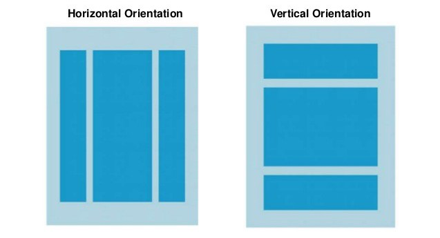

## Linear Layout

**LinearLayout** is a view group that aligns all children in a single direction, vertically or horizontally. 

You can specify the layout direction with the *android:orientation attribute*.

Reference: [Linear Layout](https://developer.android.com/guide/topics/ui/layout/linear) 

## Relative Layout

**RelativeLayout** is a view group that displays child views in relative positions. 

The position of each view can be specified as relative to sibling elements (such as to the left-of or below another view) or in positions relative to the parent RelativeLayout area (such as aligned to the bottom, left or center).

Reference: [Relative Layout](https://developer.android.com/guide/topics/ui/layout/relative)

## Constraint Layout

**Constraint Layout** 

## Views

**View** is a class that represents the basic building block for user interface components. 
A View occupies a rectangular area on the screen and is responsible for drawing and event handling. 
View is the base class for widgets, which are used to create interactive UI components (buttons, text fields, etc.).

Reference: [View](https://developer.android.com/reference/android/view/View)
